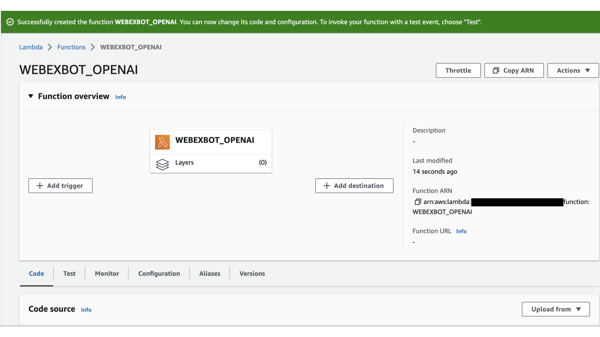

# webexbot-openai
Webex bot working with openai's API

## Overview
In this lab, we will create an interactive webex chatbot using openai's API for responses.

Chatbot logic resides in Lambda, an aws serverless service. We use aws Cloud9 as our development environment. That way we can upload code to Lambda more easily.

If there is an input from the user, Chatbot logic accesses the openai API with that input as a prompt and outputs the response to the user.

## Requirements

- python3.9
- openai
- webexteamssdk
- Cisco webex account
- OpenAI account
- AWS account

> __To use OpenAI's API, we need to create an account and get an API key. This lab uses the $18.00 free trial allotted for the first time.__

> __Each AWS resource is billed.__

## What you do is

1. Create a Webex bot
2. Create AWS Lambda function
3. Create AWS API Gateway
4. Create CIsco Webex webhook
5. Create an AWS Cloud9 instance
6. Upload Deployment package to Lambda

## 1. Create a Webex bot

Create a bot on [Webex for Developers](https://developer.webex.com/). You can go to the creation page from __Start Building Apps__ .

Select __Bots__ .

Enter __Bot name__ , __Bot username__ , select __Icon__ and click __Add Bot__ .

Enter a __Description__ and click __Add Bot__ .

Once the bot is created, copy the __Bot access token__ to the editor.

## 2. Create AWS Lambda function

